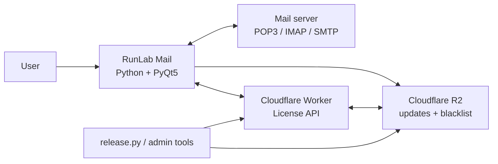
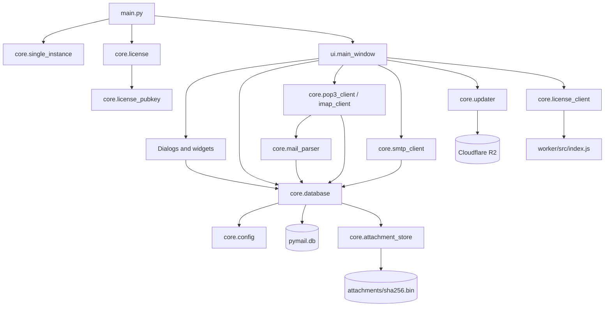

# Project Map — RunLab Mail (`email_client_app`)

Peta ini merangkum arsitektur dan dependensi utama berdasarkan source code saat ini.

## System context



## Runtime layers



## Main feature flows

```mermaid
flowchart LR
    subgraph Receive email
      A1[MainWindow / FetchWorker] --> A2[POP3 or IMAP client]
      A2 --> A3[MIME parser]
      A3 --> A4[SQLite + attachment store]
      A4 --> A5[EmailList / EmailView]
    end

    subgraph Send email
      B1[ComposeDialog] --> B2[recipient_utils + contacts]
      B1 --> B3[smtp_client.build_message]
      B3 --> B4[SMTP server]
      B3 --> B5[Outbox / Sent in SQLite]
    end

    subgraph License
      C1[license_client] --> C2[/register or /verify]
      C2 --> C3[Worker]
      C3 --> C4[R2 user registry]
      C3 --> C5[Ed25519 signed license]
      C5 --> C6[Local signature verification]
    end

    subgraph Update
      D1[updater] --> D2[update_manifest.json]
      D2 --> D3[Download release ZIP]
      D3 --> D4[Verify SHA-256]
      D4 --> D5[Install and restart]
    end
```

## Module ownership

| Area | Main modules | Responsibility |
|---|---|---|
| Bootstrap | `main.py`, `core/single_instance.py`, `core/install_location.py` | Start app, prevent duplicate process, ensure safe install path |
| Main UI | `ui/main_window.py`, `ui/email_list.py`, `ui/email_view.py` | Three-panel client, navigation, reading, sync orchestration |
| Compose | `ui/compose_dialog.py`, `ui/paste_aware_edit.py`, `core/recipient_utils.py` | Rich email authoring, pasted content/images, recipient logic |
| Accounts | `ui/account_dialog.py`, `ui/accounts_list_dialog.py` | POP3/IMAP/SMTP account configuration and connection tests |
| Persistence | `core/database.py`, `core/config.py`, `core/secure_storage.py` | SQLite, settings, migrations, protected secrets |
| Mail transport | `core/pop3_client.py`, `core/imap_client.py`, `core/smtp_client.py` | Receive, junk sync, send, MIME assembly |
| Mail ingestion | `core/mail_parser.py`, `core/mail_import.py`, `core/attachment_store.py` | Parse/import mail and deduplicate attachments by SHA-256 |
| Contacts | `core/contacts.py`, `ui/recipient_completer.py` | Contact cache/import/export and address completion |
| Licensing | `core/license.py`, `core/license_client.py`, `ui/license_*` | Local validation, Worker API, activation/admin UI |
| Updates | `core/updater.py`, `ui/update_dialog.py`, `ui/about_dialog.py` | Manifest checks, download, integrity verification, install |
| Release/admin | `build.py`, `release.py`, `admin/` | Package executable, publish releases, issue/revoke licenses |
| Backend | `worker/src/index.js` | Public registration/verification and authenticated admin API |

## High-coupling nodes

- `ui/main_window.py` is the central orchestrator and depends on most UI and core services.
- `core/database.py` owns the broadest persistence API and is shared by transport, contacts, imports, and UI.
- `core/config.py` determines data paths used by the database, attachments, secure storage, and theme.
- `worker/src/index.js` combines routing, license rules, signing, and R2 persistence in one backend module.

## External boundaries

- Email servers: POP3, IMAP, and SMTP over Python standard-library clients.
- Cloudflare Worker: `/register`, `/verify`, and authenticated `/admin/*` endpoints.
- Cloudflare R2: release ZIPs, update manifest, revocation data, and Worker registry objects.
- Windows: DPAPI/secure storage, Outlook COM import, shortcuts, and packaged executable lifecycle.

## Tests currently visible

- `tests/testcategories.py`: category/database behavior.
- `tests/testreply_all.py`: recipient parsing and Reply All behavior.
- Root `test_browser*.py` and `test_mark_read.py`: manual/ad-hoc UI and database checks.

